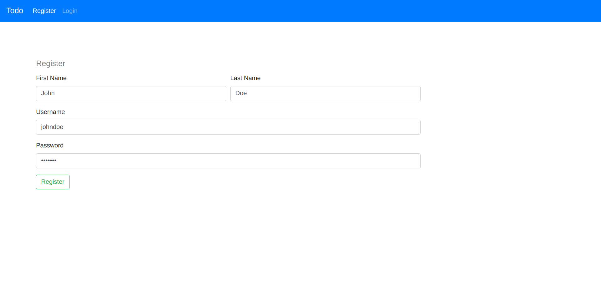

## DEPI DevOps Capstone Project

This is a **Todo App** based on a **microservice architecture**, originally forked from [nishantwrp/microservices-example](https://github.com/nishantwrp/microservices-example). We extended the project significantly by:

* ⚡ **Reducing Docker image sizes** by 25%–90%
* 🐳 **Containerizing** all services and deploying via **Helm**
* ☁️ **Running production-grade deployments on AWS EKS**
* 🔁 **Automating CI/CD pipelines** using:

  * **Jenkins** for app-level builds and deployments (`gimmeursocks/DEPI_GP`)
  * **GitHub Actions** for infrastructure automation (`gimmeursocks/DEPI_GP_Infra`)

We manage infrastructure using **Terraform** and **Ansible**, organized in two repositories:

* [📦 App Source Code](https://github.com/gimmeursocks/DEPI_GP)
* [🛠️ Infrastructure Code (Terraform, Ansible, Helm)](https://github.com/gimmeursocks/DEPI_GP_Infra)

---

## 🏗️ Architecture Overview

Here’s a high-level diagram of the architecture:

| Service                           | Language / Framework  | Description                                                                                                                                                   |
| --------------------------------- | --------------------- | ------------------------------------------------------------------------------------------------------------------------------------------------------------- |
| [`frontend`](./frontend/)         | HTML, CSS, JavaScript | A static web app served using `lighttpd` in Docker.                                                                                                           |
| [`api-service`](./api-service/)   | Python, FastAPI       | Exposes RESTful APIs consumed by the frontend. Delegates logic via `gRPC` to `auth-service` and `todo-service`. Protobuf definitions are [here](./protobuf/). |
| [`auth-service`](./auth-service/) | Go                    | Handles user registration and authentication. Uses **PostgreSQL** on **Amazon RDS**.                                                                          |
| [`todo-service`](./todo-service/) | TypeScript (Node.js)  | Manages CRUD operations for todos. Uses **MongoDB** hosted on **Amazon DocumentDB**.                                                                          |

---

## ⚙️ CI/CD Workflow

We use a hybrid CI/CD setup:

* **Jenkins** (`DEPI_GP`):

  * Builds Docker images for all microservices
  * Pushes them to Amazon ECR
  * Triggers Helm deployments to EKS

* **GitHub Actions** (`DEPI_GP_Infra`):

  * Automates Terraform workflows (plan/apply)
  * Lints and validates Ansible playbooks
  * Handles Helm chart validations

---

## 🖼️ Screenshots

### 🔐 Authentication Screens

| Login Page                                   | Register Page                                      |
| -------------------------------------------- | -------------------------------------------------- |
|  |  |

### 📋 Main App Interface

| Home Page                                  |
| ------------------------------------------ |
|  |
